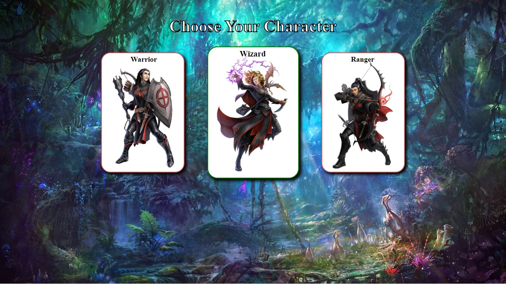
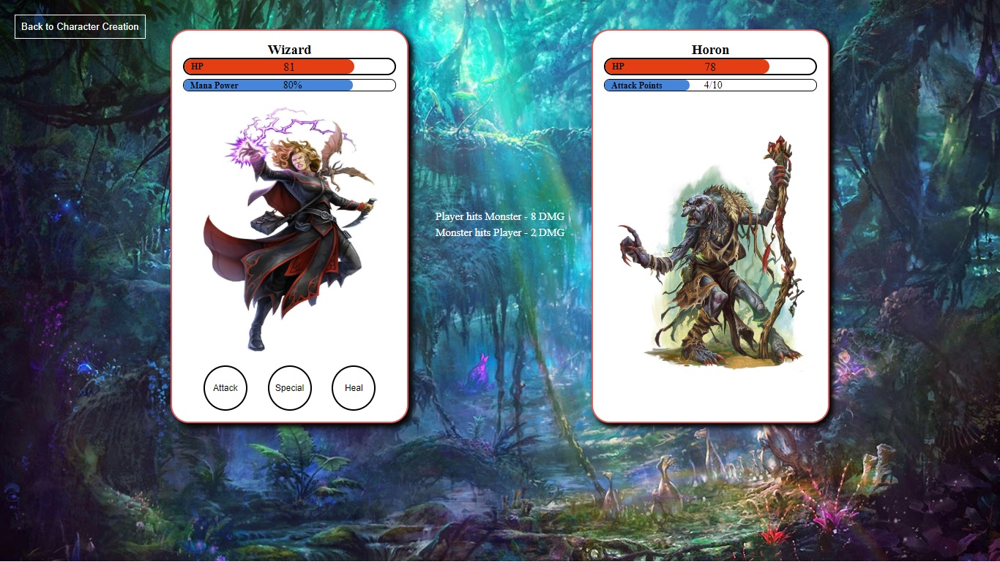
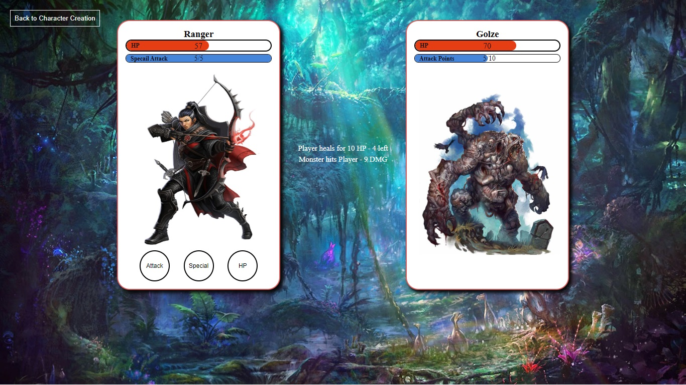
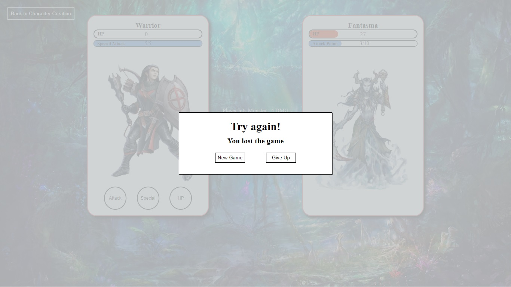

# battle-card-game-vue
# RPG Card Game - front-end Vue <h1>

 ### Single Page Application <h3>
	* list with 6 monsters 
	* list with 3 playable characters 
	* every game starts with random opponent
	* every opponent has special attack on every 10 hero's attacks
	* every opponent has different min and max hit 
 ### Home Page - Character Page <h3>
	* 3 playable characters 
 

 ### Wizard Game <h3>
	* mana power bar 
	* heal skill
	* special attack and heal cost mana
 

### Ranger Game <h3>
	* spacial attack when collect 5 points from normal attacks
	* 5 Heal potions on every match
 

### Lost-Win Page <h3>
	* Player can gives up and goes back to home page and switch character
	* Continue the game If player wins
	* New Game if player lost the match
 

